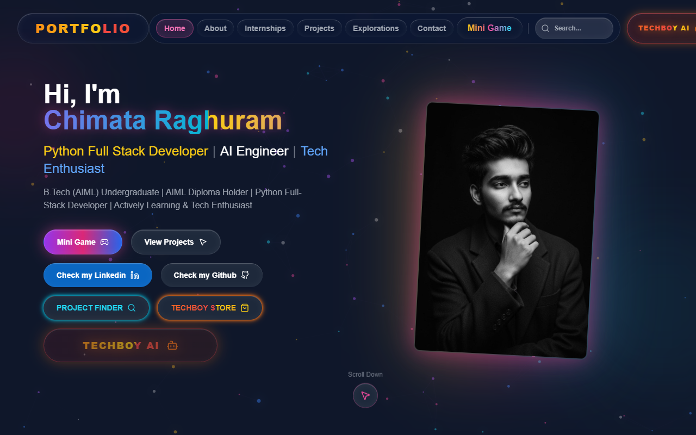
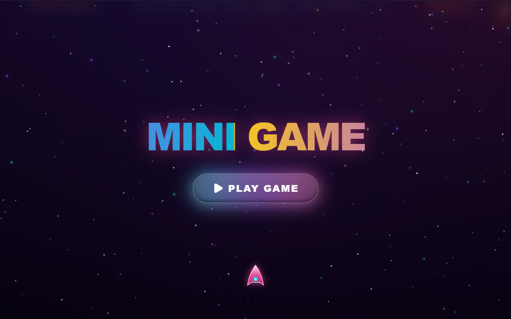
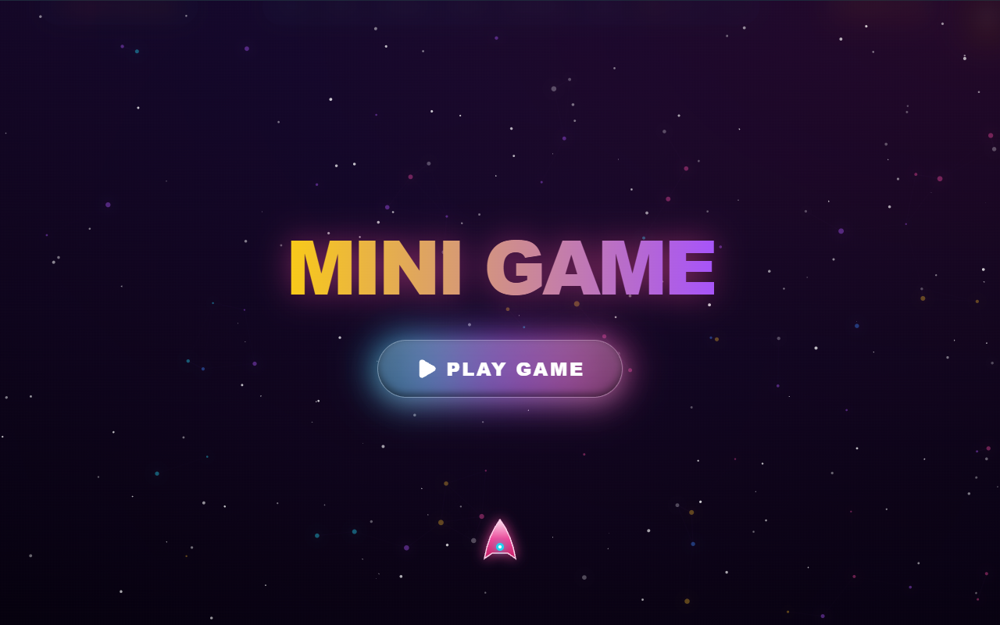
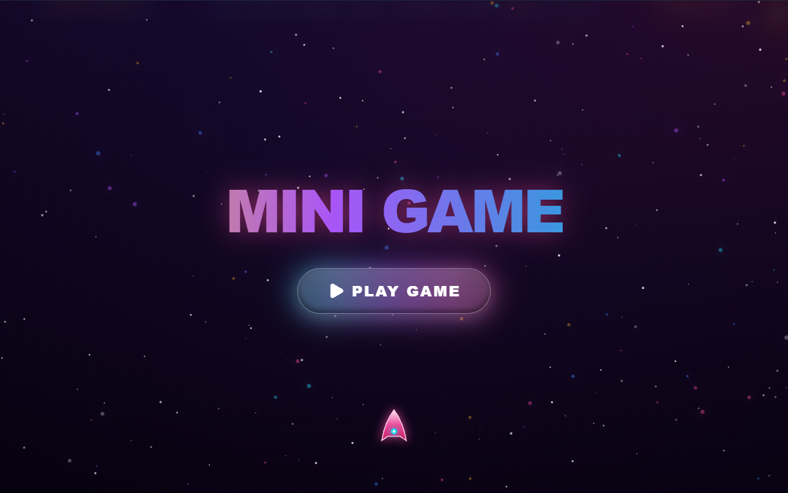
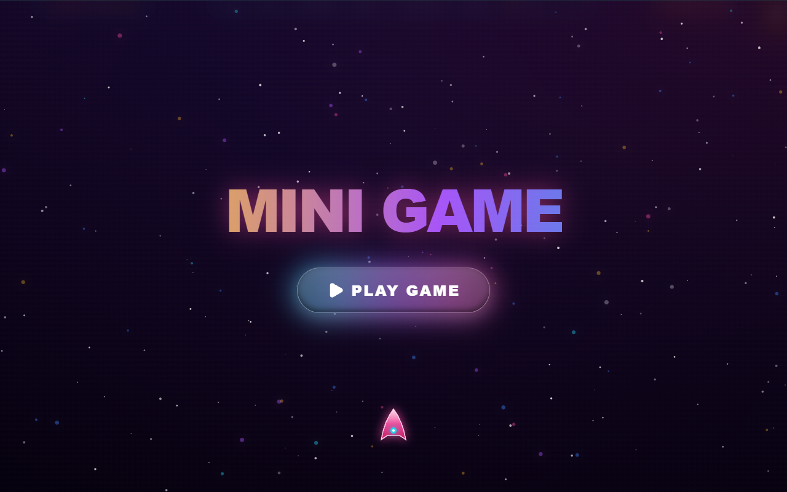

  <h1>🚀 Chimata Raghuram - Portfolio</h1>
  
Official portfolio of <strong>Chimata Raghuram</strong>, AI Engineer & Full Stack Developer.

  
  

 

Welcome to my professional portfolio showcasing my skills, projects, and journey. This site acts as an interactive resume and AI integrations hub, capped off with a custom-engineered hidden mini-game!

## 📸 Portfolio Overview

*A sleek, modern glassmorphism UI designed with vibrant colors and rich typography.*

### 📂 Portfolio Structure
The portfolio comprises multiple dynamic sections crafted for top-tier user experience:
1. **Home**: High-impact hero section with interconnected links to AI side-projects.
2. **About**: Details regarding my background, integrated flawlessly with my educational timeline.
3. **Skills**: A highly interactive, floating tech-stack map visualizing my proficiencies.
4. **Internships & Projects**: Project showcase carousels and detailed logs of my professional experience.
5. **Contact**: Smooth connections to my social platforms and direct-email pipeline.
6. *(Hidden)* **Mini-Game**: An interactive easter egg docked safely into the footer!

## 🛠 Technologies Used

- **Frontend Core**: React 18, TypeScript, HTML5
- **Build Tool**: Vite
- **Styling**: Tailwind CSS (with highly customized animations and glassmorphism)
- **Icons**: Lucide React
- **Engine**: Pure HTML5 `<canvas>` API (rendering 60FPS Parallax & Particles)
- **Audio Context**: Native Web Audio API for synthetic game sound generation.

---

## 🎮 The "Space Invaders" Mini-Game

Tucked at the bottom of the page is a fully-custom built mini-game utilizing pure Vanilla Javascript logic and the Canvas API. 

### Features of the Game:
*   **Dynamic Instructions Level**: A beautiful overlay greeting players with how to play.
*   **Hyperspeed Parallax Simulation**: Stars stretch out into lines and background particles whip past the ship while playing to simulate extreme upward velocity. 
*   **Level Progression**: Formations spawn dynamically according to screen-size. Defeat enemies to advance through 5 distinct levels. Enemy behaviors scale recursively (Wait, Sway, ZigZag, Dive).
*   **Boss Fight**: Level 5 spawns a giant health-scaling boss that tracks player movements.
*   **Drops & Powerups**: Enemies occasionally drop 'Spread', 'Rapid', or 'Shield' items. The game halts on the initial drop to quickly train the player with a custom UI overlay!

### Game Screenshots

  
  
   
  <em>Left: Game Instructions & Start 5-sec Timer. Right: Active gameplay featuring spread shots and hyperspeed particles.</em>

  
  
   
  <em>Left: The Power-up Instructions tutorial pause. Right: The custom Game Over screen handling "Fatal Breaches".</em>

---

## 📜 License
**© 2026 Chimata Raghuram. All Rights Reserved.**

This repository contains proprietary code and assets. Unauthorized copying, modification, distribution, or use of this source code, via any medium, is strictly prohibited. You may not use this code for commercial or non-commercial purposes without explicit written permission from the owner.
