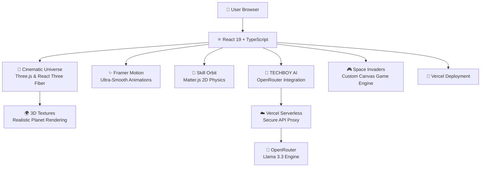

<div align="center">

  <h1>CHIMATA RAGHURAM</h1>
  
  <a href="https://chimataraghuram.vercel.app/">
    
  </a>

  <br/><br/>

  <!-- High-Status Tech Badges -->
  <p align="center">
    
    
    
    
    
  </p>

  <!-- Primary CTA Action Bar -->
  <p align="center" style="margin-top: 15px;">
    <a href="https://chimataraghuram.vercel.app/">
      
    </a>
    &nbsp;&nbsp;
    <a href="https://www.linkedin.com/in/chimataraghuram/">
      
    </a>
  </p>

  <br/>

  <p align="center" style="max-width: 800px; margin: 0 auto; line-height: 1.6;">
    <em>"A cinematic, 3D space-themed digital ecosystem redefining the professional portfolio. Engineered for zero compromise, blending high-performance WebGL graphics, real-time physics, interactive storytelling, and an integrated AI assistant to deliver a premium experience."</em>
  </p>

</div>

---

## 🌌 The Cinematic Universe

This portfolio has been completely reimagined as an interactive voyage through space. The experience includes:

- **Immersive 3D Preloader**: Fly through a rotating solar system with hundreds of glowing stars before entering the portfolio universe.
- **Dynamic 3D Planetary Systems**: Using **React Three Fiber** and **Three.js**, the background features massive, high-resolution planets (Earth, Moon, Neptune, Mars) that realistically morph and rotate as you scroll.
- **Parallax Starfields & Nebula Fogs**: Deep, multi-layered parallax backgrounds that respond to your scroll and section transitions.
- **Glassmorphism 2.0**: The UI floats beautifully above the 3D canvas with heavy blur backdrops, creating an ultra-premium aesthetic.

---

## 🖼️ Project Showcase
*Visual evidence of the platform's high-fidelity design and interactive elements.*

<div align="center">

### **01. The Identity Hub**
*High-performance central dashboard for professional identity.*  


<br/>

### **02. About & Skill Orbit**
*Clean, glassmorphism-driven introduction with a physics-based tech stack visualization.*  


<br/>

### **03. Professional Internships**
*Career chronology showcase featuring industry experience and verifiable certificates.*  


<br/>

### **04. The Project Vault**
*Premium gallery showcasing high-fidelity real-world deployments and full-stack applications.*  


<br/>

### **05. Milestones & Achievements**
*Curated list of professional certifications and significant career milestones.*  


<br/>

### **06. Space Invaders Mini-Game**
*Custom 60FPS Canvas-based game engine built for in-browser interactive engagement.*  


<br/>

### **07. Contact & Social Terminal**
*Central point for direct communication and professional social network integration.*  


</div>

---

## 🏗️ System Architecture



---

## ⚡ Core Capabilities

> [!TIP]
> **Performance Optimized**: This ecosystem is built on Vite 6 and React 19, utilizing `Suspense` and dynamic imports to ensure lightning-fast load times even with heavy 3D assets.

- **🌍 WebGL 3D Engine**: Uses `Three.js` and `@react-three/fiber` to render massive 3D planets, atmospheric scattering, and 3000+ interactive stars at 60FPS.
- **🧠 Physics-Driven UI**: Uses `Matter.js` to create an interactive "Skill Orbit" that responds to gravity and collision physics.
- **🤖 Intelligence Layer**: Integrated AI assistant that has deep knowledge of the developer's career history and project details.
- **🎮 Micro-Game Integration**: A custom 60FPS Space Invaders engine built natively on HTML5 Canvas provides active engagement and demonstrates complex state management.
- **✨ Fluid Motion**: `framer-motion` drives complex orchestrations, from the spaceship preloader sequence to scroll-triggered section reveals.

---

## 🛠 Tech Stack

### **The Core Engine**
- **Framework**: React 19
- **Build Tool**: Vite 6
- **Logic**: TypeScript
- **Styling**: TailwindCSS + Vanilla CSS + Glassmorphism Shaders

### **The Specialized Layer**
- **3D Graphics**: Three.js, React Three Fiber, React Three Drei
- **Animations**: Framer Motion
- **2D Physics**: Matter.js
- **Icons**: Lucide-React
- **AI**: OpenAI / OpenRouter (Llama 3.3)
- **Game Engine**: Custom HTML5 Canvas Logic

---

## 📁 Project Structure

```bash
PORTFOLIO/
├── frontend/
│   ├── src/
│   │   ├── components/
│   │   │   ├── universe/      # The 3D Three.js Engine & Cinematic backgrounds
│   │   │   ├── IntroScreen/   # The spaceship solar system preloader
│   │   │   └── ...            # Main UI modules (Hero, About, Projects, etc)
│   │   ├── hooks/             # Custom React hooks (useIsMobile, useActiveSection)
│   │   ├── utils/             # Helper functions (scrolling, sound engine)
│   │   ├── App.tsx            # Modular section aggregator & Lazy Loading
│   │   └── constants.ts       # Central Truth - All metadata (Projects, Skills, Stats)
│   ├── public/
│   │   └── planets/           # High-resolution WebGL planet textures
│   └── vite.config.ts         # Optimized build settings
└── api/                       # Vercel Serverless functions (AI Proxy)
```

---

## 📜 Professional Ethics (License)
This project is licensed under the **MIT License**.

> [!IMPORTANT]
> **Attribution Requirement**:
> You are encouraged to study and fork this repository. However, proper attribution to **Chimata Raghuram** is mandatory. Do not represent this holistic design as your own original creation.

---

## ✍️ The Author
**Chimata Raghuram**  
*Python Full Stack Developer • AI/ML Enthusiast*

<div style="display: flex; gap: 10px;">
<a href="https://github.com/chimataraghuram">
  
</a>
<a href="https://www.linkedin.com/in/chimataraghuram/">
  
</a>
</div>

<br/>

<div align="center">
  
</div>
