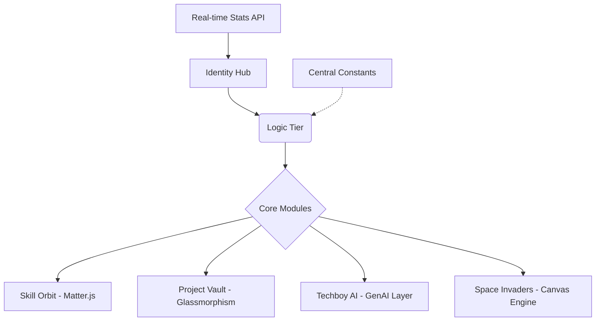
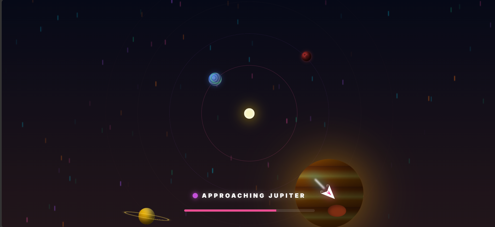
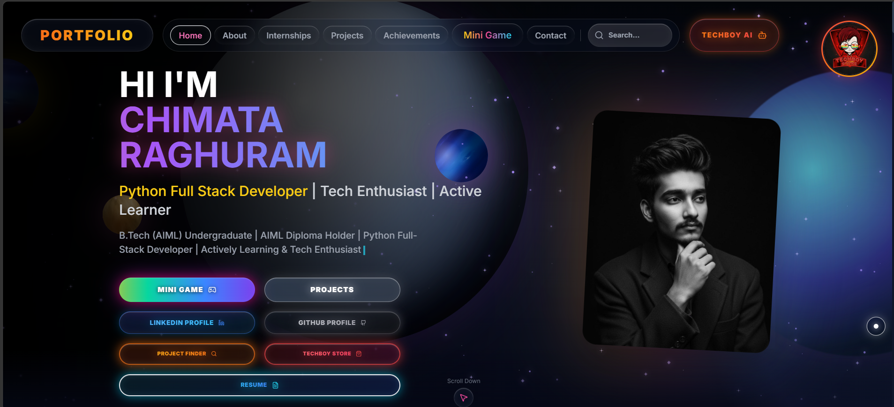
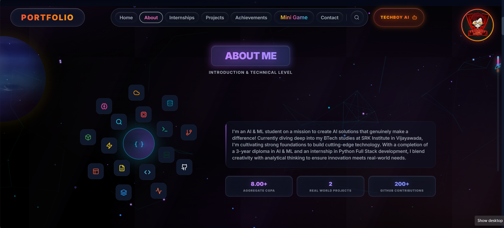
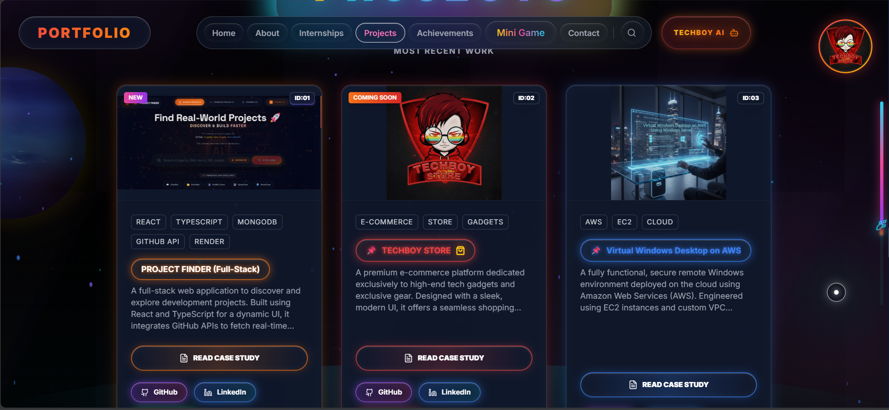
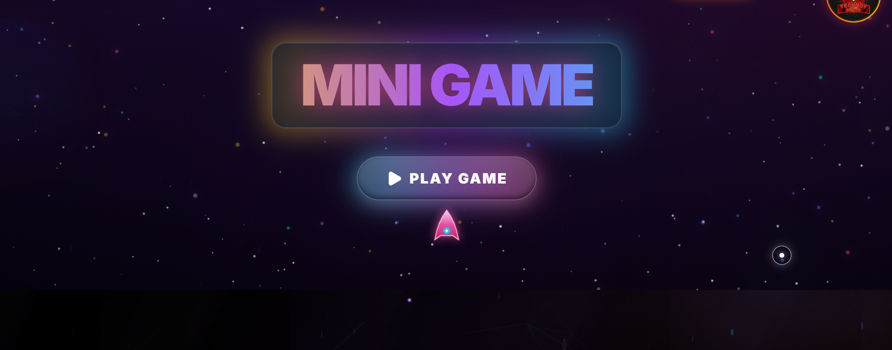
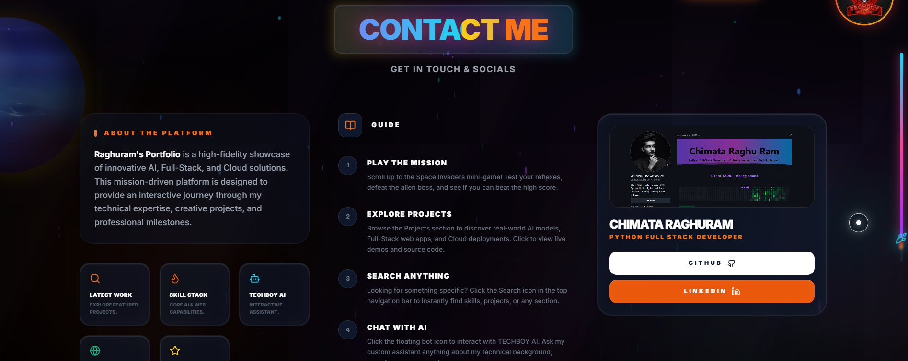
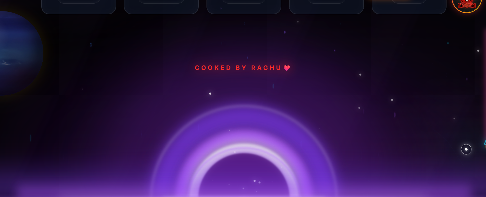
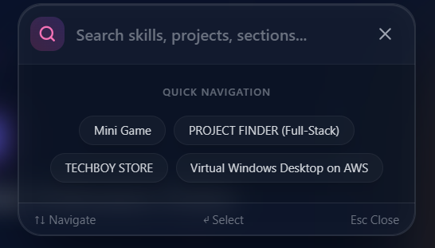
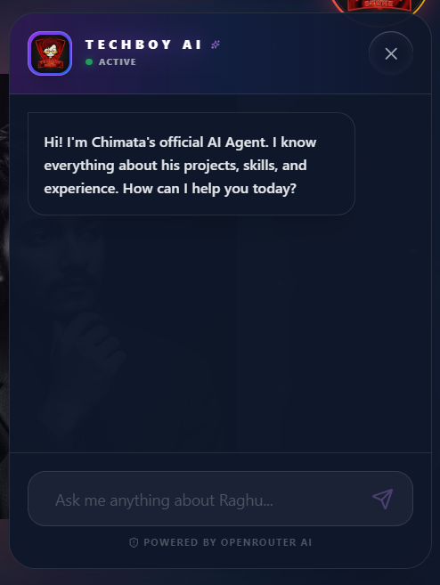

<div align="center">

  <!-- Logo Section -->
  

  <!-- Title & Professional Identity -->
  <h1 style="color: #ff8c42; font-size: 3.8rem; font-weight: 900; letter-spacing: -3px; margin: 0; text-transform: uppercase; line-height: 1;">
    CHIMATA RAGHURAM
  </h1>
  <h2 style="color: #e4e4e7; font-size: 1.6rem; font-weight: 700; margin-top: 5px; letter-spacing: 2px;">
    NEXT-GEN PORTFOLIO ECOSYSTEM
  </h2>
  
  <p style="font-size: 1.1rem; color: #a1a1aa; font-weight: 500; margin-top: 15px;">
    Industrial Grade Performance • AI-Augmented Logic • Interactive Physics
  </p>

  <!-- High-Status Tech Badges -->
  <div style="margin: 25px 0; display: flex; justify-content: center; gap: 10px; flex-wrap: wrap;">
    
    
    
    
    
  </div>

  <!-- Primary CTA Action Bar -->
  <div style="margin: 30px 0;">
    <a href="https://chimataraghuram.vercel.app/">
      
    </a>
    &nbsp;&nbsp;
    <a href="https://www.linkedin.com/in/chimataraghuram/">
      
    </a>
  </div>

  <!-- Industrial Identity Statement -->
  <p style="max-width: 900px; font-size: 1.25rem; line-height: 1.8; font-weight: 600; color: #f4f4f5; font-style: italic; background: rgba(255,140,66,0.05); padding: 25px; border-radius: 20px; border-left: 5px solid #ff8c42;">
    "Transfoming stagnant profile artifacts into a high-fidelity, interactive digital innovation hub. This ecosystem bridges the gap between pure engineering and premium user experience, powered by real-time physics and generative intelligence."
  </p>

</div>

---

## 🏗️ System Architecture

This isn't just a website; it's a modular ecosystem designed for performance and scalability.



---

## 🖼️ Project Showcase
*Visual evidence of the platform's high-fidelity design and interactive elements.*

<div align="center">

### **01. The Identity Hub**
*High-performance central dashboard for professional identity.*  


<br/>

### **02. About & Skill Orbit**
*Clean, glassmorphism-driven introduction with a physics-based tech stack visualization.*  


<br/>

### **03. Professional Internships**
*Career chronology showcase featuring industry experience and verifiable certificates.*  


<br/>

### **04. The Project Vault**
*Premium gallery showcasing high-fidelity real-world deployments and full-stack applications.*  


<br/>

### **05. Milestones & Achievements**
*Curated list of professional certifications and significant career milestones.*  


<br/>

### **06. Space Invaders Mini-Game**
*Custom 60FPS Canvas-based game engine built for in-browser interactive engagement.*  


<br/>

### **07. Contact & Social Terminal**
*Central point for direct communication and professional social network integration.*  


<br/>

### **08. Omni-Search Navigation**
*Global search terminal for instant access to skills, projects, and platform sections.*  


<br/>

### **09. Techboy AI Assistant**
*Integrated GPT-powered AI agent providing real-time insights into the developer's journey.*  


</div>

---

## ⚡ Core Capabilities

> [!TIP]
> **Performance Optimized**: This ecosystem is built on Vite 6 and React 19, ensuring sub-second load times and 60FPS animations across all modules.

- **🧠 Physics-Driven UI**: Uses `Matter.js` to create an interactive "Skill Orbit" that responds to user mouse movements and gravity.
- **🤖 Intelligence Layer**: Integrated `OpenAI` assistant that understands the developer's entire career history and project details.
- **🎮 Micro-Game Integration**: A custom game engine provides "active engagement", proving proficiency in complex logic handling and State management.
- **💎 Glassmorphism 2.0**: Specialized CSS shaders and backdrop filters create a high-fidelity "Industrial-Premium" look.

---

## 🛠 Tech Stack

### **The Core Engine**
- **Architecture**: React 19 (Main Library) + Vite 6 (Build Engine)
- **Logic**: TypeScript (Strict Typings)
- **Styling**: Vanilla CSS3 + Framer Motion (Fluid Layouts)

### **The Specialized Layer**
- **Physics**: Matter.js
- **Icons**: Lucide-React
- **AI**: OpenAI GPT-Turbo Integration
- **Game Physics**: Custom Canvas Logic

---

## 📁 Project Structure

```bash
PORTFOLIO/
├── components/          # High-reusability Glassmorphism UI components
├── constants.ts         # Central Truth - All metadata (Projects, Skills, Stats)
├── types.ts             # Global TS Interface definitions
├── App.tsx              # Modular section aggregator
├── screenshots/         # High-fidelity visual gallery
└── vite.config.ts       # Optimized build settings
```

---

## 📜 Professional Ethics (License)
This project is licensed under the **MIT License**.

> [!IMPORTANT]
> **Attribution Requirement**:
> You are encouraged to study and fork this repository. However, proper attribution to **Chimata Raghuram** is mandatory. Do not represent this holistic design as your own original creation.

---

## ✍️ The Author
**Chimata Raghuram**  
*Python Full Stack Developer • AI/ML Enthusiast*

<div style="display: flex; gap: 10px;">
<a href="https://github.com/chimataraghuram">
  
</a>
<a href="https://www.linkedin.com/in/chimataraghuram/">
  
</a>
</div>

<br/>

<div align="center">
  
</div>
